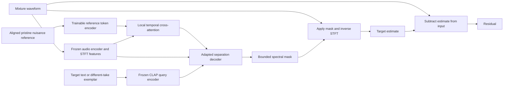

# Architecture options for source-faithful target extraction

**Select Route A for the next experiment.** Its purpose is to test whether clean supervision and time-resolved nuisance context overcome the previous zero-shot limitations. The other routes are serious alternatives with identifiable triggers, not parallel commitments. All specifications below are proposed designs; none has been trained or profiled in S0.

The shared target convention, identifiability boundary and acceptance contract are defined in [the main study](D:/Code/RhythmAlign/experiments/s0_research_reframing/S0_RESEARCH_STUDY.md). Training targets are microphone-domain source images where available. Unknown phone nonlinearities do not become physically additive merely because a model has three heads.

## 1. Common interface and constraints

Every route accepts a mixture waveform, sample rate, target specification, available context and context validity/timing metadata. It returns target, residual, acceptance intervals, estimated existence/recoverability and a reproducibility manifest. A known-nuisance estimate is optional. Multiple target identities are represented by a set query or union target, not by adding independently extracted stems without checking double counting.

For independently predicted waveform sources \(\tilde s_k\), an optional projection is

\[
e=y-\sum_k\tilde s_k,\qquad \hat s_k=\tilde s_k+w_ke,\quad \sum_kw_k=1.
\]

Weights may be fixed or nonnegative uncertainty-based. In conservative export, preserve the target prediction and assign the bookkeeping discrepancy to the residual. Log both pre-projection error and correction magnitude; otherwise a projection hides model inconsistency. \(r=y-\hat s\) is always valid bookkeeping, never independent proof of separation. Use a linear STFT/ISTFT pair and perform final waveform reconstruction after chunk blending. [Consistency constraints](https://research.google/pubs/differentiable-consistency-constraints-for-improved-deep-speech-enhancement/)

No route imposes energy-sum equality or universal target magnitude below mixture magnitude. No route treats a reference, chart or visual action as permission to synthesize an expected contact. “Causal evidence” below means evidence about the physical event, not a real-time/causal network requirement.

### Shared supervised loss definitions

For a valid target \(s\), define scale-dependent error

\[
L_{sd}(\hat s,s)=\frac{\|\hat s-s\|_2^2}{\|s\|_2^2+\epsilon_{floor}},
\]

with a predeclared floor based on the capture noise calibration. Define multi-resolution spectral loss as the mean of spectral convergence and log-magnitude L1 at windows 256/512/1024/2048 samples at 32 kHz. Use only bands in the common evaluation bandwidth. Add a capped negative SI-SDR loss on target-present examples, event/continuous-contact weighted waveform error, and a direct silence loss on verified target-absent examples. Silence does not go through SI-SDR.

Joint-known-source training can add \(L_{sd}(\hat m,m)\), \(L_{sd}(\hat r,n)\), and a pre-projection sum error. Presence heads use BCE with unknown labels masked out. Recoverability heads predict whether fixed fidelity tolerances are met on validation-derived examples, with calibration on separate data. They must see mixture evidence; text or video alone cannot establish recoverability.

Counterfactual pairs use the same target with varied nuisance:

\[
L_{inv}=\|F_s(s+n_1,C_1)-F_s(s+n_2,C_2)\|_1,
\]

but only where the target remains observable under the training mixture conditions. Apply lower weight or omit at deliberately censored/fully ambiguous cases; forcing invariant confident output there teaches hallucination. Loss weights are hyperparameters to freeze on development data, not a new theoretical guarantee.

## 2. Route A — Reference-conditioned pretrained discriminative extractor

### Inputs and encoders

Input mono mixture at 32 kHz, exact aligned pristine music (retain both reference channels as context if available), a positive text description and optionally a different-take target exemplar. The S1 primary query is fixed text; clean exemplar variation is a secondary query control, not another tuned arm.

Reuse the locally available CLAPSep mixture encoder and decoder. Cache query embeddings; freeze semantic encoders and their normalization statistics initially. Retain the actual checkpoint's STFT: the inspected local wrapper defaults to **1,024 samples, hop 320, mixture phase**, not AudioSep's separate 2,048-window release. Its decoder produces sigmoid magnitude masks. The current `inference_from_data` sets evaluation mode and wraps decoding in `no_grad`; implement a separate gradient-enabled training forward without changing historical code. [Local source](D:/Code/RhythmAlign/experiments/r3_audio_query/third_party/CLAPSep/model/CLAPSep.py), [decoder](D:/Code/RhythmAlign/experiments/r3_audio_query/third_party/CLAPSep/model/CLAPSep_decoder.py).

The proposed reference encoder takes reference STFT real/imaginary components and log magnitudes, projects frequency information through small convolutions to 128-dimensional time tokens, and downsamples from 100 Hz to 25 Hz. Use separate channel embeddings for stereo reference channels, with a mono/null indicator. An alignment-quality token carries estimated offset uncertainty, missing-reference status and path-change flags.

### Conditioning and backbone

Insert one residual cross-attention adapter at the decoder's reconstructed time sequence **before the final mask network**, leaving existing parameter shapes intact. Mixture features supply queries; aligned reference tokens supply keys/values. Use four heads of width 32, relative-time bias, a ±0.5-second local reference neighborhood and a null-reference token. Upsample the attention result to decoder frame rate; a zero-initialized linear projection maps it to the existing feature width. The no-reference arm receives the same adapter capacity with only the null condition.

The pretrained backbone retains its existing global positive/negative query path. The new path supplies *when and what this playback contains*. It does not decode reference features directly into output sound. Reference tokens remain locally time-resolved; a pooled music embedding is a separate baseline.

### Output and provenance

The S1 signal path is:

The paired null-reference arm keeps the same decoder/fusion design and supplies the null reference condition. The diagram describes a proposed adaptation, not a released new architecture.

**S1 output:** \(\hat s=\mathrm{ISTFT}(M_\theta(Y,C)Y)\), \(M\in[0,1]\); residual \(y-\hat s\). This is a deliberately controlled representation choice because it preserves the pretrained head. It is not the program's definition of authenticity. Add a small 25-Hz presence head from mixture-conditioned features; its output is logged, not used as a hard waveform gate in S1.

**S3 extension if justified:** replace the final head with target/known-nuisance/unknown-residual complex mapping, keeping semantic and reference encoders. Initialize from the mask solution, supervise source images and log pre-projection inconsistency. A TF-GridNet or band-split decoder is an alternative if the existing head cannot retain transients. [TF-GridNet](https://arxiv.org/abs/2211.12433)

### Loss and training

S1 uses normalized waveform L1, multi-resolution spectral loss, target-absent energy loss and presence BCE; target/residual bookkeeping is exact by construction and therefore contributes no informative sum loss. Use the same loss weights, examples, crop schedule, optimizer and update count in reference/no-reference arms. Warm up the new adapter while keeping the pretrained decoder intact, then train decoder and adapter. Do not add LoRA tuning to only one arm.

Train on real recorded targets mixed with independent nuisance; include music-correlated contacts, missing expected hits, offbeat contacts and target-free display/music conditions. Reference dropout and corrupted-reference examples teach graceful disregard. Label-preserving amplitude changes apply to target, mixture and reference with documented gain conventions. Post-mixture nonlinear corruption is evaluated separately because targets require an explicit distortion convention.

### Inference and compute

Decode mixture, validate channels/sample clock, align reference using RhythmAlign, construct context and estimate in overlapped 10-second windows. Use input-derived normalization shared across conditions and undo it exactly. Apply complementary chunk windows, report edge quality, and form residual only after waveform blending. Export a float target, float residual and context/confidence manifest; remix with pristine music at a separately specified gain.

Local objective: batch 1, AMP, frozen encoders, 5-second supervised content padded/masked to the pretrained 10-second interface. Query encoders can be offloaded after embedding; dynamic mixture features cannot be precomputed once if waveforms are remixed. Estimate 4–7.5 GB training peak, subject to a 100-step profile. Model-specific caching and attention dimensions need measurement; inference memory does not predict backward memory.

### Expected failures and trigger to leave this route

Likely failures are mixture-phase limitations, weak/continuous-event omission, same-class confusion, wrong-reference over-suppression, normalization drift and reference/music shortcut learning. A test-set success only on synthetic IID mixtures is not a deployment result. If the bounded oracle mask is poor, change representation before concluding neural extraction fails. If the oracle is good but the fitted network underperforms, investigate supervision/domain shift and optimization. If fine-tuning helps but the reference does not, keep the no-reference model rather than inventing a benefit.

## 3. Route B — Multimodal foundation extraction with selective acceptance

### Inputs, encoders and conditioning

Mixture plus target text, optional tracked visual object/person mask, positive/negative temporal examples; optionally a new aligned nuisance stream. Start with an existing broad system as a **frozen comparator**, especially SAM Audio. Its released interfaces already cover text, vision and span cues. A future design would retain its codec/semantic encoders and add nuisance-reference token cross-attention with missing-modality indicators. [SAM Audio paper](https://arxiv.org/abs/2512.18099), [release](https://github.com/facebookresearch/sam-audio).

The proposed extension uses mixture latents and video evidence for target identity, and an independent high-resolution STFT branch for fine timing, transient error and reference matching. Frozen visual tokens at approximately 8–25 Hz need not determine every tap boundary; audio retains the sample-level path. Text, identity and nuisance tokens carry different role embeddings.

### Backbone, output and loss

Adapt a pretrained latent flow-matching DiT with small adapters, generating joint target/residual latents. Decode both; measure autoencoder reconstruction error on isolated target takes before testing separation. Add supervised waveform/spectral/event losses at decoded outputs to the original flow objective, plus target-absence loss, residual supervision and pre-projection reconstruction loss. The high-resolution branch can predict corrective complex residuals, but that introduces another capacity/faithfulness ablation.

A waveform projection enforces bookkeeping after decoding; it cannot certify target authenticity. Draw a small fixed set of samples at evaluation to measure instability, not to select whichever sounds most convincing. Stable output across seeds is not proof of truth; a deterministic biased model can also be stable. Use a separately calibrated mixture-conditioned acceptance model with scene/capture OOD flags.

### Training and inference

First establish an existing checkpoint's performance on our truth tiers. Fine-tune only if it is competitive and produces errors that targeted data can address. Include missing/contradictory conditions and verified target-absent examples; losses must penalize unsupported timbres/events, not only query similarity. Avoid building an unconditional sound generator from scratch.

At inference, track selected source, extract features, run fixed-step flow sampling and decode, then assess fidelity confidence. Low confidence causes an uncertainty flag or disclosed fallback. A learned judge may screen artifacts but cannot independently prove that faint source content occurred. Preserve any residual/projection changes and sample seed in the manifest.

### Compute and failure modes

Plan 24–48 GB cloud inference for a bounded comparator trial, verifying the actual chosen size/configuration. Adaptation may need 1–4 × 40–80 GB GPUs and a much larger reliable dataset; estimate 100–1,000 GPU hours for a campaign only after profiling. These are allowances, not official SAM requirements. Gated checkpoint access remains a practical dependency; no access failure is scored as poor separation.

Risks include codec loss of contact microstructure, prior-driven event completion, plausible but altered timbre, negative-prompt confusion and biased automated judging. This route may deliver the best perceptual performance, but only acceptance/coverage and ground-truth results can establish suitability for the product contract. It is the next major alternative if Route A cannot meet quality requirements and the modern frozen comparator shows a better fidelity frontier.

## 4. Route C — Adaptive nuisance explanation plus target extraction

### Inputs and encoders

Mixture, aligned stereo pristine reference, target query/enrollment, optional calibration segment. Stage 1 uses a reference-domain STFT adaptive filter. Stage 2 receives **raw mixture, cancellation residual and predicted nuisance**, plus the positive target embedding. Keeping raw mixture as a bypass allows recovery from destructive cancellation errors.

### Conditioning/backbone/output

Use NKF-style learned filter adaptation for a linear baseline. A later constrained loudspeaker model has three polynomial/saturating reference basis functions followed by short frequency-domain adaptive filters, with explicit parameter limits and path-state smoothing. Do not label this a full phone-DSP model. [NKF official model](https://github.com/fjiang9/NKF-AEC) and [Meta-AF](https://arxiv.org/abs/2204.11942) are the starting mechanisms.

The proposed second stage is a compact four-block TF-GridNet-style model with 64-dimensional local features, intra-frequency/temporal modeling, query FiLM and cross-attention to nuisance features. It predicts target RI spectrum and optional remaining known nuisance; residual is formed in waveform space. A small transfer-validity head prevents blindly trusting a stale path.

### Losses and training

Train the transfer module first on playback-only recordings or exact known-path mixtures, with waveform echo error and smooth/limited filter updates. Freeze it when target evidence indicates double talk; in dense correlated gameplay, blind minimization of residual energy is unsafe. Train stage 2 on supervised target source images and deliberate stage-1 errors, with target, nuisance, absence and pre-projection losses. Finally allow tightly regularized joint tuning, with target-only examples checking that the nuisance branch cannot explain away contacts.

For target-only input and nonmatching reference, require \(\hat m\approx0\) and \(\hat s\approx y\). A “remove all speech first” cascade is rejected: speech may be the target in other domains, and a generic speech enhancer could irreversibly remove contacts. Nuisance modules must be conditioned on the current target policy.

### Inference, compute and risks

Align and estimate path validity, run cancellation, run target extraction with raw bypass, blend chunks and audit residuals. Initial NKF uses 16 kHz, so a fair baseline must report this bandwidth loss; a full-band retrained version is a separate system. Stage-2 32/48-kHz processing cannot recreate the missing high band from a 16-kHz residual alone, hence the raw path.

A compact pipeline should be feasible for 8-GB inference; 8–24 GB is a sensible training range, roughly 10–100 GPU hours for a pilot after data exist. Engineering is harder than Route A because stage interfaces, synchronization, changing paths and error propagation must be validated.

Its clearest failure is target subtraction when gameplay aligns with music. Additional risks are nonlinear reference mismatch, slow convergence after movement and confidence overestimation. Prefer this route only if independently measured reference-only modeling is strong and a raw-bypass cascade beats direct reference conditioning under the same target-preservation budget.

## 5. Route D — Foundation features plus a compact personalized separator

### Inputs and encoders

Mixture and 1–5 clean target examples from different takes; text/class label optional. Freeze M2D or CLAP as query/mixture feature extractor, but keep a parallel 32/48-kHz complex STFT encoder. Time-varying reference tokens can be added later; they are not necessary for this route's primary personalization test. [SoundBeam meets M2D](https://arxiv.org/abs/2409.12528) motivates the architecture family.

### Conditioning/backbone/output

Pool enrollment examples for global identity and retain local enrollment tokens for cross-attention. Use a 3–10M-parameter conditional TCN/compact GridNet with query FiLM in each block. Predict complex deep-filter coefficients across five adjacent frames, with an optional direct RI residual to model phase-sensitive overlap. The latter is an explicit ablation because it weakens simple input-filter constraints. Output target/residual and presence scores.

### Loss and training

Generic pretraining uses real-source synthetic mixtures and target-only/absent examples. Adapt adapters, FiLM and output layers to a small new domain with scale-dependent, spectral and event losses. Support exemplars must never be the exact held-out target waveform. Different-take same-instance examples distinguish personalization from waveform memorization. Hard negatives include similar objects and other players/cabinets.

Test-time adaptation is limited to enrollment/calibration material with anchor replay and a fixed update cap. Do not adapt on sealed scored excerpts unless explicitly reporting a transductive protocol. Unsupervised residual minimization alone is insufficient; retain the pre-adaptation model for rollback.

### Inference, compute and risks

Encode exemplars once, extract long recordings with overlap-add, calibrate confidence using validation targets with similar enrollment quality, and retain uncertainty when identity is ambiguous. A frozen encoder plus compact decoder can fit 8-GB inference/training for short segments; broader decoder pretraining may need 24–80 GB and tens to hundreds of GPU hours. Compact size does not remove the need for diverse real target data.

Failure modes include noisy exemplar transfer, averaged embeddings erasing discriminative details, cross-instance leakage, foundation features missing microtexture and overfit test-time adaptation. This route is attractive if Route A's large pretrained decoder resists adaptation or if a few-shot product requirement becomes central.

## 6. Comparison and ranking

Qualitative judgments concern **near-term success on the S1 pilot**, not an empirically estimated probability. No comparative model trials were run in S0.

| Criterion | A: reference-conditioned adaptation | B: foundation flow separator | C: cancellation + extraction | D: features + personalized decoder |
|---|---|---|---|---|
| Overall next-step rank | **1** | 3 for adaptation; high-priority frozen comparator | 4 | 2 |
| Expected S1 success | Highest information per effort; plausible gain | Potentially strong zero-shot quality; fidelity unknown | Depends on accurate path modeling | Plausible with good exemplars; new decoder data burden |
| Novelty potential | Low for adapter alone; medium for validated fidelity/objective result | Low for general prompting; medium for new reliability result | Low-to-medium given PAEC/AEC precedents | Low-to-medium given SoundBeam/M2D precedents |
| Implementation difficulty | Moderate | High for adaptation | High | Moderate-to-high |
| Distinct training data burden | Low-to-moderate domain seed | Moderate-to-high, especially AV | Moderate transfer + target pairs | Moderate; low only after suitable pretraining |
| Inference cost | Low-to-moderate | Highest; iterative | Moderate | Lowest-to-moderate |
| 8-GB feasibility | Yes, proposed limited adaptation pending profile | Do not assume; bounded/offloaded trial only | Compact prototype plausible | Compact prototype plausible |
| Cloud training need | Contingency for S1; useful later | Likely | Useful full-band | Useful generic pretraining |
| Generalization potential | Good shared interface, domain adapters | Broadest existing prior | Best where exact playback exists | Good across enrollment-supported targets |
| Provenance faithfulness | Easier to audit; bounded head can omit targets | Requires strongest reconstruction/absence evidence | Interpretable nuisance path; target-erasure risk | Detail path helps; identity/capacity risk |

**Decision sequence:** run A; use B frozen to avoid mistaking a weak baseline for the frontier; move toward complex A/D if the representation fails; consider C if measured nuisance transfer is strong. The S1 reference ablation can invalidate the chosen conditioning hypothesis without invalidating learned target extraction. No route is retained solely for publication novelty.
